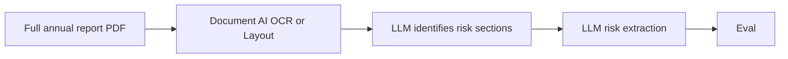
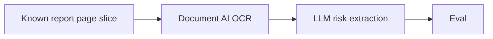

# Risk Intelligence Pipeline Design

## Stack Choices
The pipeline is implemented in Python 3.13 with `uv`, Pydantic v2, Google Cloud Document AI, and Gemini on Vertex AI through the direct `google-genai` SDK.

Gemini was chosen for cloud consistency: Document AI already requires Google Cloud, so using Vertex AI keeps authentication and billing in the same cloud. The model is configurable through environment variables so the implementation can swap between cheaper/faster and stronger models without changing code.

The pipeline intentionally does not use LangChain or a similar orchestration framework. This slice has no conversation state, no tool-using agent loop, no retrieval workflow, and no dependent chain of sequential LLM calls. The extraction step is one schema-constrained Gemini request per parsed section, followed by local Pydantic validation, so the direct SDK is simpler, easier to debug, and has fewer moving parts. An orchestration framework would become more relevant if the product grows into multi-step section discovery or a stateful analyst chatbot with RAG.

## Pipeline Shape
The pipeline is a sequence of stages, each reading its input from disk, processing it, and writing output to disk in the format the next stage expects. This keeps stages replaceable without changing code elsewhere in the pipeline.

### Full Target Pipeline

Section discovery and risk extraction are separate, focused stages. Discovery narrows the full report to likely risk-bearing pages, reducing irrelevant-section leakage, and the risk of relevant risks being overlooked in a long context window. Extraction then operates on relevant pages. The trade-off is cascading false negatives: a page missed during discovery cannot be recovered by extraction, so discovery should favour recall and pass uncertain candidate pages onward.

### Implemented Slice

Notes on the pipeline:
- The pipeline runs by default with cached files for parsed report and extracted risks to avoid repeated charged API calls. Cache reuse may be overridden with the `--parse` and `--extract` flags; see [README.md](README.md) for usage details.
- **Document AI Layout** highlights headlines and ties them to their sections, which would provide more coherent data to the LLM. However, it is 6-7x more expensive than **Document AI OCR**, which is why the latter was chosen for this slice.
- The case brief asks the pipeline to evaluate itself, so **Eval** is placed in the pipeline. In practice, this is the wrong place for a golden-set regression check unless the processed report is the same report used to create the golden dataset. For example, it is not meaningful to compare a new Maersk report with the golden records from Vestas's 2025 report.
- The better implementation is to keep **Eval** as an integration test that always uses the same report and the same golden dataset. CI can run that test when a Pull Request is opened, so regressions due to a weaker model, broken parser, prompt change, or extraction-code change are caught before merging to main.

### Input Data
File path: `annual_reports/annual_report.pdf` (gitignored). The first slice processes pages 50-51 and 71-74. The remainder of the report is omitted from the repo's scope to avoid the risk of the Coding Agent reading the full report and spending all available Credits.

Identifying the report's relevant sections (risk management; material impacts, risks and opportunities) is an integral pipeline component and should be the highest prioritized next task, but it requires processing of the full report — costing both Document AI pages and LLM tokens. Given the case's instruction to focus on certain pages and LLM credit limitations, this slice accepts known page ranges instead.

### Report PDF Parsing
Alternatives:
- `pdfplumber`: free and useful for a report-specific prototype, but its reading order requires custom multi-column rules that will not generalize across report issuers.
- Document AI: returns text plus layout and page structure from a document processor, avoiding report-specific column heuristics while retaining page-level provenance.
- No parsing (LLM-only): LLM operates directly on the report pdf. A valid alternative but the multimodal nature of pdfs may reduce the LLM's ability to identify sections and extract risks.

Design choice: use Document AI OCR. The parser parses each page's text and records its page number. Document AI OCR may not preserve a complex table's intended reading order.

### Risk Data Extraction
Gemini on Vertex AI extracts risks from one parsed section at a time. `RiskList` and its nested Pydantic models define the response JSON Schema supplied to Gemini and validate the returned response with `extra="forbid"`. The extractor then checks that every cited section and page was supplied to the model and that the evidence quote appears in that exact page.

Category prediction consistency has been a challenge. To address this, the prompt defines every category and resolves overlap by the risk's primary driver rather than generic consequences such as cost or delay; targeted examples clarify known ambiguous boundaries.

The `evidence_quote` field is intentionally part of the extraction contract as a grounding mechanism: Gemini is asked to copy a verbatim span from the report page, and the pipeline validates that the quote really exists on the cited page. This reduces unsupported or invented risk claims and makes each extracted risk auditable back to a page.

### Evaluation
Evaluation compares the extracted `RiskList` against a hand-labelled golden set of risks. It checks that each expected risk is present by title, has the expected page and category, and cites the section that owns that page (recall). Because the golden set is exhaustive for this fixed report and page range, it also flags any extracted risk with no matching golden title (precision). It also checks that every extracted evidence quote appears in the supplied page text (groundedness). A quote passing this check is not proof the risk itself is real, only that the cited text exists on the cited page — see [STRETCH.md item 5, the conditional LLM-as-a-judge inline retry gate](STRETCH.md#L9) for a way to close that gap if it turns out to matter in practice.

## Scaling (Latency, Cost and Throughput)
At the expected volume of 200+ reports per quarter, cost and throughput are not meaningful constraints. Processing about 2.2 reports per day does not require parallel infrastructure, and a small amount of extra latency is acceptable. The options below are future scaling paths, not requirements for this slice.

1. **Asynchronous LLM calls**: Once section discovery is available, independent sections can be submitted concurrently with async Gemini calls.
2. **LLM-only**: Document AI could be skipped and the report sent directly to an LLM for section discovery and extraction. This may be slightly cheaper and simpler, but it weakens deterministic page-level provenance and may increase token usage. An evaluation should confirm equivalent recall, groundedness, and page mapping before making that change — see [STRETCH.md item 2](STRETCH.md#L6) for the benchmark this needs.
3. **Load balancing and autoscaling**: Cloud Run provides load balancing and autoscaling in case of heavy traffic.
